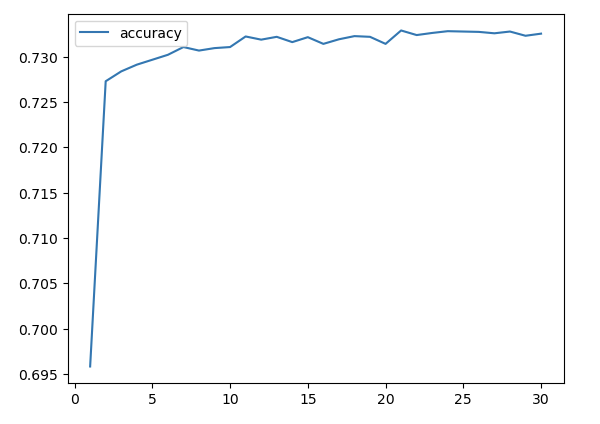
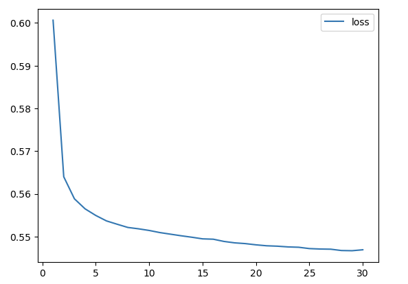
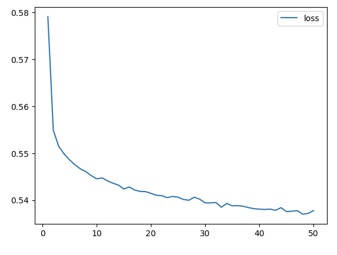
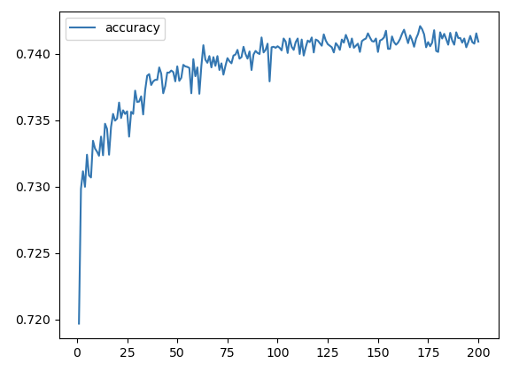
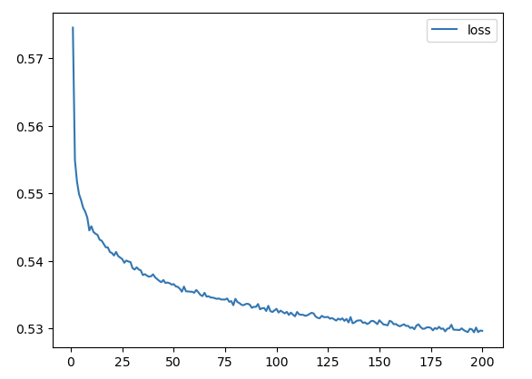
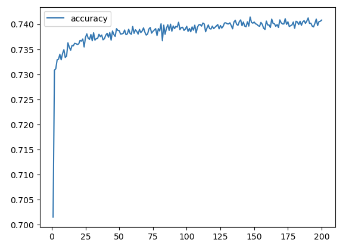
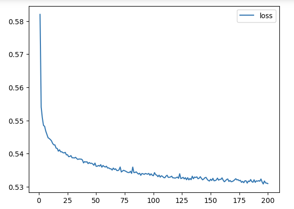

# Module 21: deep-learning-challenge

## Alphabet Soup Funding Analysis Report

## Overview 
### The Objective
The nonprofit foundation Alphabet Soup has asked us for a tool that can help it select the applicants for funding with the best chance of success in their ventures. We will be applying our knowledge of machine learning and neural networks and using the features in a dataset provided to us by Alphabet Soup to create a binary classifier that can predict whether applicants will be successful if funded.  

### The Data
As mentioned above, Alphabet Soup’s business team has shared a CSV containing more than 34,000 organizations that have received funding from the foundation over the years. Within this dataset are a number of columns that capture metadata about each 
organization; they include:

- **The Features**:
    - **APPLICATION_TYPE**: Alphabet Soup application type
    - **AFFILIATION**: Affiliated sector of industry
    - **CLASSIFICATION**: Government organization classification
    - **USE_CASE**: Use case for funding
    - **ORGANIZATION**: Organization type
    - **STATUS**: Active status
    - **INCOME_AMT**: Income classification
    - **SPECIAL_CONSIDERATIONS**: Special considerations for application
    - **ASK_AMT**: Funding amount requested  

- **The Target**
    - **IS_SUCCESSFUL**: Was the money used effectively  

- **The Extras**:
    - **EIN** and **NAME**: Identification columns   

## Step 1: The Preprocessing
After loading and conducting an initial review of the ***charity_data.csv***, identifying the *features* and *target* became the first step to complete. As noted above, in this case the ***IS_SUCCESSFUL*** column was deemed to be our target. The ***EIN*** and ***NAME*** columns were considered to be extraneous information and columns that we could remove from the dataset by way of the .drop function. The remaining columns were then designated as our features. 

- #### *What variable(s) are the target(s) for your model?*
    - **IS_SUCCESSFUL**  
        
- #### *What variable(s) are the features for your model?*
    - **APPLICATION_TYPE**
    - **AFFILIATION**
    - **CLASSIFICATION**
    - **USE_CASE**
    - **ORGANIZATION**
    - **STATUS**
    - **INCOME_AMT**
    - **SPECIAL_CONSIDERATIONS**
    - **ASK_AMT**   

- #### *What variable(s) should be removed from the input data because they are neither targets nor features?*
    - **EIN** and **NAME**

Once identified and the extraneous columns dropped, the remaining columns were further cleaned by determining the number of unique values for each through the use of the *.nunique()* function and binning outlier values for certain columns into catchall bins labelled "Other". In this case, this was achieved by way of applying *.value_counts* on the ***APPLICATION_TYPE*** and ***CLASSIFICATION*** columns and creating respective cut off values for each (<500 and <300) where the value would be replaced with the "Other" designation by way of the *.replace* function.

Upon confirming the Dtypes with *.info()*, we next created a categorical variable list of columns which were converted and encoded using the *pd.get_dummies* function. The resultant ***encoded_df*** was then merged with the original ***application_df***, dropping the original column values in the process.

With our data now cleaned, it was seperated into ***X*** and ***y*** based on our features and target designations. It was next split into training (***X_train, y_train***) and testing (***X_test, y_test***) datasets using the *train_test_split* function. *StandardScaler()* variables were instantiated and the ***X_train*** data was fit to the scaler and then scaled concurrently but seperate from the ***X_test*** data using the *.transform* function.   

## Step 2: The Deep Learning
A model (***nn***) was now defined as well as its number of input features (44) and the number of hidden nodes (8 and 5) for each layer as well as their respective activiation functions (*ReLu, sigmoid*). A model *.summary()* was returned indicating 411 trainable parameters would be applied. The model was then compiled and a callback log initiated to record the model's weights at certain intervals. Finally, the model was fit and trained using the dataset for a duration of 30 epochs. The *.evaluate* function revealed a loss of 55.7% (0.5574) and accuracy score of 72.9% (0.7292).   

## Step 3: The Optimization
While our original model did a respectable job given the challenge, Alphabet Soup now asked us to attempt to reach a new goal of a predictive accuracy higher than 75%. To achieve this, we sought to optimize the model.

- **Attempt 1: Optimization A:**
   - The ***nnopt_a*** again used 44 input features, but we thought trying a more robust model might yield improved results. As such, two more hidden layers were added bringing the total to 4. We also increased the number of neurons per layer to 22, 17, 33 and 11 respectively (ReLu remained the activation function throughout the hidden layers). The summary revealed 2,361 total trainable parameters with this model which would be run on an increased 50 epochs this time. The resulting evaluation indicated we'd been able to improve the accuracy to 72.9% (0.7290) and reduce the loss to 55.6% (0.5557).  

- **Attempt 2: Optimization B:**
    - The ***nnopt_b*** model again used 44 input features. Based on the improvement of nnopt_a over our original model, we thought we'd try a similar approach of increased complexity across the board. Another two hidden layers were added, bringing the total to 6. We also again increased the number of neurons per layer to 33, 22, 33, 11, 6, and 18 respectively (TanH was applied to the first three hidden layers this time instead and ReLu to the latter 3). The summary revealed 3,583 total trainable parameters. We also again increased the epochs to 200. The resulting evaluation indicated we'd been again able to improve the accuracy, this time to 73.1% (0.7307). The loss was returned as 57% (0.5698).  

- **Attempt 3: Optimization C:**
    - Our final optimization model, ***nnopt_c***, again used the 44 input features. While nnopt_b did improve over nnopt_a, the change was minor. We thought we'd try less layers this time and change the neurons to hopefully finetune it and find a middle ground as greater complexity does not necesarily always equate to a better model. A hidden layer was removed, reducing the total to 5. The number of neurons per layer this time were 32, 16, 48, 12, and 6 respectively (ReLu was applied for all five layers in this model). The summary revealed a slightly lower total of trainable parameters at 3,457. They would again be tested at 200 epochs. The resulting evaluation indicated we'd gone backward in both accuracy, achieving 73% (0.7298), and loss with 58.6% (0.5856).   

## The Results
### Deep Learning Model Scores:
- #### **Model 1 (nn):**
    - Input Features: **44**
    - Hidden Layers: **2**
        - L1: **8** nodes, *ReLu* act
        - L2: **5** nodes, *ReLu* act
    - Accuracy Score: **72.9%**
    - Loss Score: **55.7%**

  

- #### **Model 2 (opta):**
    - Input Features: **44**
    - Hidden Layers: **4**
        - L1: **22** nodes, *ReLu* act
        - L2: **17** nodes, *ReLu* act
        - L3: **33** nodes, *ReLu* act
        - L4: **11** nodes, *ReLu* act
    - Trainable Paramaters: **2,361**
    - Accuracy Score: **72.9%**
    - Loss Score: **55.6%**

  

- #### **Model 3 (optb):**
    - Input Features: **44**
    - Hidden Layers: **6**
        - L1: **33** nodes, *TanH* act
        - L2: **22** nodes, *TanH* act
        - L3: **33** nodes, *TanH* act
        - L4: **11** nodes, *ReLu* act
        - L5: **6** nodes, *ReLu* act
        - L6: **18** nodes, *ReLu* act
    - Trainable Paramaters: **3,583**
    - Accuracy Score: **73.1%**
    - Loss Score: **57%**

  

- #### **Model 4 (optc):**
    - Input Features: **44**
    - Hidden Layers: **5**
        - L1: **32** nodes, *ReLu* act
        - L2: **16** nodes, *ReLu* act
        - L3: **48** nodes, *ReLu* act
        - L4: **12** nodes, *ReLu* act
        - L5: **6** nodes, *ReLu* act
    - Trainable Paramaters: **3,457**
    - Accuracy Score: **73%**
    - Loss Score: **58.5%**

   
    

## Summary
Based on the original model as well as the three optimization models, it appears that the more robust the model applied ot this dataset, the better the performance turned out to be. In this case, it meant using model optb with 6 hidden layers having 33, 22, 33, 11, 6, and 18 neurons respectively activated by a mix of TanH and ReLu for a longer duration of 200 epochs. There were a total of 3586 trainable parameters with this model. 

However, the gains from the original model to even the best of these optimised models were negligible despite increasing the number of trainable paramaters exponentially. This suggests that there is a likely a far more effective model or setup than the ones tested here. Perhaps reducing or increasing the values for each bin or including fewer columns/features in the models training, or a combination of all of the above would have yielded the desired outcome. 

It should be noted though that keras_tuner was also used to taid in the search for he best hyperparamters in regard to this challenge and after over 200 trials, the best val_accuracy score was returned at around 73%. Overall then, it seems the target of an above 75% accuracy rate is indeed a difficult ask and given the subject of the dataset we were trying to create a predictive model from, this is not all that surprising. 

Ultimately, a greater allotment of resources in terms of time taken to test other optimization models and setups of the data would be the route most strongly recommended in this case. Barring that, the optb model was the best of what was actually tested to date.